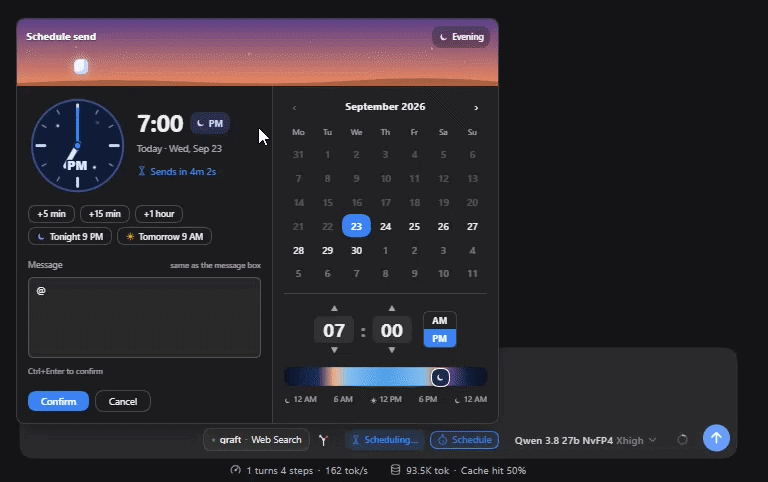
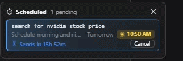
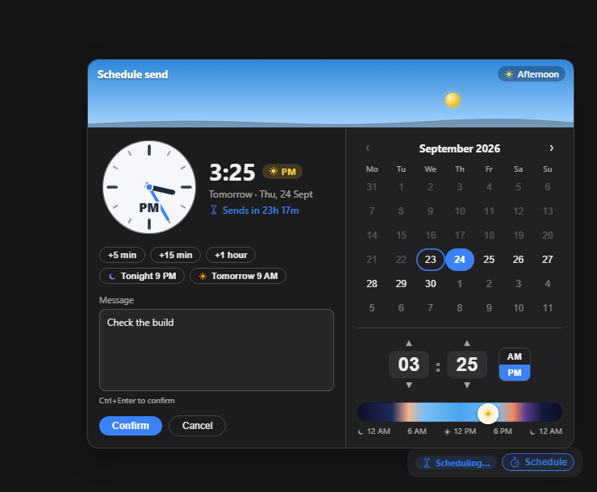
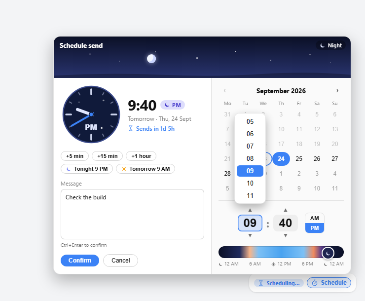
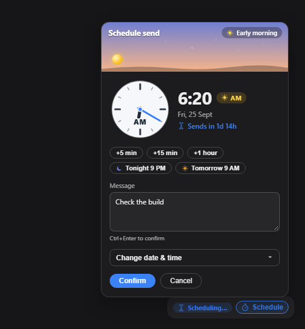

# dsh-schedule-later

      

A [DeepSeek Harness](https://github.com/deepseek-ai/deepseek-harness) plugin that schedules a message into a dsh chat for later — picked by you from a date and time picker in the message box, or by the model with its own tools.

**It runs on the host, not in the browser.** Schedule it, close the tab, go to sleep: the dsh process sends it on time as a **normal user bubble**, and the model replies to it exactly as if you had pressed Send.





It does five things:

- **A ⏱️ Schedule button in the message box** — a day/night scheduler with a sky header that follows the chosen time, an analog clock, an AM/PM sun-and-moon pill and quick picks, on the same row as Send.
- **Host-side delivery** — timing and message injection both run inside the dsh host process, so the browser is only a view; it works with the tab closed.
- **A sidebar “⏱️ Scheduled” panel** — every pending message across all chats, grouped by chat, soonest first, tinted by the time it sends, where each message can be sent now, re-timed or cancelled.
- **Three tools for the model** — `schedule_message`, `list_scheduled_messages`, `cancel_scheduled_message` — so the assistant can come back to a chat on its own.
- **A `schedule-later` skill** — teaches the model when to schedule its own check-ins unprompted.

## Install

Requires a working dsh with a `web` profile.

```sh
dsh plugin --profile web add dsh-schedule-later
dsh --profile web
```

Or install from GitHub or a local folder instead:

```sh
dsh plugin --profile web add github:adithyanraj03/dsh-schedule-later
dsh plugin --profile web add /path/to/dsh-schedule-later
```

Then **restart dsh** (`dsh --profile web`) if it was already running, and **hard-refresh the browser** (Ctrl+Shift+R / Cmd+Shift+R) — a plain refresh can serve a cached client bundle. A **⏱️ Schedule** button appears in the message box row, and a **⏱️ Scheduled** entry appears at the bottom of the sidebar.

### Coming from `dsh-send-later`?

This is the same plugin under its published name. **Do not run both** in one profile: they register the same three model tools and the same message-box button, so remove the old one first — its row from the profile's `cordis.patch.yml` and its entry from the profile's `package.json`.

Pending messages live in a folder named after the plugin, so to keep them, copy the queue across while dsh is stopped:

```sh
mkdir -p ~/.dsh/dsh-schedule-later
cp ~/.dsh/dsh-send-later/tasks.json ~/.dsh/dsh-schedule-later/tasks.json
```

## What you get

### The scheduler

Sits on the message box row, next to Send. Type as usual → click **⏱️ Schedule** → the scheduler opens (defaults to now + 5 minutes, any future time allowed) → **Confirm** turns the draft into a scheduled message and clears the box. **Nothing is sent immediately.** Multi-line text and Markdown source are kept exactly as typed.

The header is a sky that follows the chosen time — dawn, day, dusk, night — with the sun or moon moving along its arc, and an analog clock sweeping to the hour, its face light by day and dark with stars by night. The time carries an **AM/PM pill with a sun or a moon**, so 9:00 PM is never mistaken for 9:00 AM. Quick picks: +5 min, +15 min, +1 hour, Tonight 9 PM, Tomorrow 9 AM, and a live “Sends in …” underneath.





It animates without being noisy: the stopwatch sweeps while you schedule and nudges on hover, the sidebar icon ticks slowly while anything is pending, and the hourglass turns over on every countdown. All of it stops when the OS asks for reduced motion.

On phones and narrow windows (≤480px) the picker folds into a near-full-width popover, with touch targets at least 40px tall:



Cancel any pending message from the in-chat list or the sidebar panel — both ask first.

### The sidebar panel

An entry at the bottom of the sidebar, with a badge counting every pending message, opens a panel listing pending messages across **all chats**, soonest first, each row showing the message in monospace (clamped to two lines), the send time and a countdown. Messages are grouped under their chat — click the chat's name to open it. Click a message for its details: the full text, who scheduled it and when, and Send now, Change time and Cancel. Send now and Cancel ask for confirmation first. Cancel from here for any chat. Entries whose chat was deleted are greyed out but can still be cancelled.


Pending messages for the current chat also appear in-chat, above dsh's To-dos, which sit next to the message box. With more than one, only the soonest is shown plus an “N more scheduled ⌄” toggle; an expanded list scrolls within a fixed height so its “Collapse ⌃” toggle never scrolls away. Any list can be collapsed by hand.

### The model tools

Three tools let the assistant schedule messages into the chat it is working in — to come back to something later without you having to remember:

| Tool | What it does |
|---|---|
| `schedule_message` | Schedule a message into **this chat**, by `delay_minutes` or an ISO 8601 `at` (no offset = this machine's local time). |
| `list_scheduled_messages` | List what is pending in this chat — yours and the assistant's — and the current local time. |
| `cancel_scheduled_message` | Cancel a message **the assistant** scheduled. |

Ask things like *“remind me at 6pm to push the release”* or *“check the CI run again in 20 minutes”*. When it fires, it arrives as a new turn and the model acts on it.

Guard rails, because an assistant that can wake itself up could otherwise do so forever:

- **This chat only.** It schedules into the chat it is running in, never another.
- **Visibly marked.** Its messages arrive starting with `[Scheduled by the assistant]`, so nobody mistakes them for you typing live.
- **At least 1 minute ahead, at most 30 days out, at most 10 pending per chat.**
- **It cannot cancel yours.** It can list your scheduled messages but only cancel its own.
- Everything it schedules shows up in the ⏱️ panel and the in-chat list, where you can cancel it.

### The skill

The plugin ships a `schedule-later` skill (`SKILL.md`), registered with dsh's skills service, whose catalog entry the model sees every turn. It teaches when to come back unprompted — a build, deploy or job still running, a page or status that will change, something you said you would do later — how to write the message so its future self can act on it cold, and to tell you what it scheduled and when. Edit `SKILL.md` to change that behaviour; it is re-read on every catalog refresh.

## Requirements

- A `web` dsh profile — `engines: dsh >= 0.1.0`
- Node 18+
- No runtime dependencies — the client bundle requires only `react`

## Licence

MIT — see the [LICENSE](LICENSE) file.
