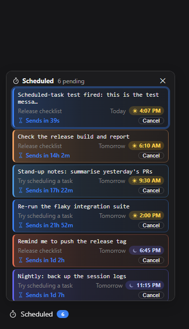

# dsh-schedule-later

A [DeepSeek Harness](https://github.com/deepseek-ai/deepseek-harness) plugin that sends a message into a chat later. Draft it in the message box, pick a time, and at that time it is posted into the same chat as a normal user message — so the model answers it exactly as if you had pressed Send. Delivery runs in the dsh host, so the browser can be closed.

The model can use it too: three tools and a skill let it schedule a check-in on its own — on a build that is still running, a page that will change, or something you said you would do later — and come back to the chat when it fires.

[View on GitHub](https://github.com/adithyanraj03/dsh-schedule-later){: .btn }

   

---

## Install

```sh
dsh plugin --profile web add dsh-schedule-later
dsh --profile web
```

Restart `dsh web` and hard-refresh the browser. A **⏱️ Schedule** button appears in the message box row, and **⏱️ Scheduled** at the bottom of the sidebar.

---

## The scheduler


- **Day or night at a glance.** The header is a sky that follows the chosen time, with the sun or moon on its arc; the clock face is light by day and dark with stars by night; the time carries an AM/PM pill with a sun or a moon.
- **Pick a time your way.** Quick picks (+5 min, +15 min, +1 hour, Tonight 9 PM, Tomorrow 9 AM), a month calendar, hour and minute columns you can click for a list or scroll to step, and a 24-hour sky slider you can drag.
- **Edit the message right there.** The popover's message box is the same draft as the chat's — typing in either shows in the other. Ctrl+Enter confirms.


---

## Everything pending, across chats



The sidebar panel lists every pending message in every chat, soonest first, each tinted by the time it sends. Click one for its details — the full message, and Send now, Change time or Cancel, each confirmed first. Click a chat's name to open it. A message in its last minute pulses.

---

## Letting the model come back on its own

| Tool | What it does |
|---|---|
| `schedule_message` | Schedule a message into **this chat**, by `delay_minutes` or an ISO 8601 `at`. |
| `list_scheduled_messages` | List what is pending in this chat, and the current local time. |
| `cancel_scheduled_message` | Cancel a message the model scheduled. |

Its messages arrive marked `[Scheduled by the assistant]`, at least 1 minute ahead and at most 30 days out, at most 10 pending per chat, and it cannot cancel yours. The bundled `schedule-later` skill tells it when a check-in is worth scheduling unprompted.

---

## Privacy

No telemetry and no third-party requests. Messages are stored only in `~/.dsh/dsh-schedule-later/tasks.json` on your machine.

---

Released under the MIT licence.
